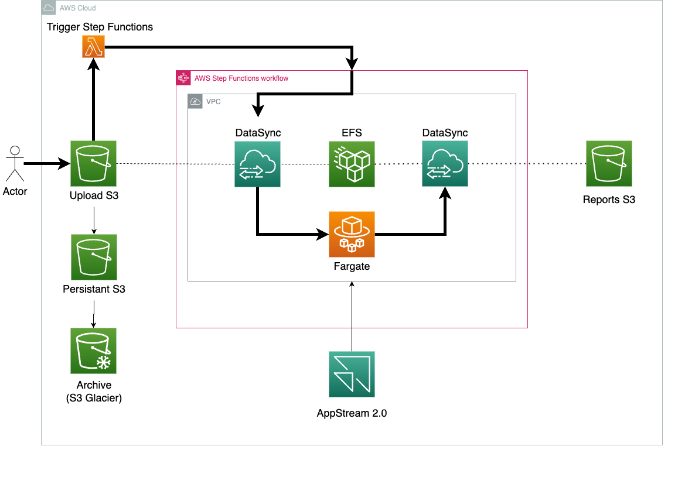

# terraform-aws-batch-processing
## Purpose
 A collection of terraform modules which creates a generic data processing pipeline. This is a recurring infrastructure pattern in both academic and commerical settings.
 The codebase is designed to be modulerised but care is needed when a subset of the modules are used.

## Description

The containerised workflow consists of three highlevel steps: upload a file (image or text base), trigger an automatic workflow which processes the uploaded data and then return the resultant output. To capture this workflow in a modern serverless design the following architected solution was developed. 

- A S3 bucket with intelligent storage options and lambda trigger is set up to receive the uploaded data. When data (file, image, etc.) arrives on the S3 bucket a lambda function is triggered which instantiates AWS Step Functions.
- AWS Step Functions consists of three states: 
1.	A DataSync task for copying the contents of the upload S3 bucket to EFS.
2.	AWS Batch which launches an AWS Fargate containerized task.
3.	A DataSync task to copy the resultant output from the Batch job on EFS to a reports S3 bucket.
- A S3 bucket denoted as Reports S3 in the schematic figure provides storage for the processed output from the container.
- AppStream 2.0 allows a potential user a virtual desktop within the VPC. This service is included to enable quality control to be carried out on the containerized workflow.

## Installation Steps

### Prerequisites 
- An [AWS account](https://console.aws.amazon.com.). 
- The [AWS CLI](https://docs.aws.amazon.com/cli/latest/userguide/getting-started-install.html) installed. 
- The [Terraform CLI](https://developer.hashicorp.com/terraform/tutorials/aws-get-started/install-cli) (1.2.0+) installed. 

Ensure that your IAM credentials can be used to authenticate the Terraform AWS provider. Details can be found on the Terraform [documentation](https://developer.hashicorp.com/terraform/tutorials/aws-get-started/aws-build). 

### Steps to set up the infrastructure 
1. To enable Appstream 2.0 one needs to first create the appropriate stacks and fleets. This can be done through the management [console](https://eu-west-2.console.aws.amazon.com/appstream2). Make note of the AppStream2.0 image name. 
2. Clone this GitHub repo. 
3. Navigate to the cloned repo in the terminal and run the following commands: 
`terraform init` 
`terraform validate`
`terraform apply`
 
4. When prompted for the `as2_image_name` pass the value from Step 1. 
5. A complete list of the AWS services which will be deployed appears. The user should check this before agreeing to the deployment (**Please be advised this will incur a cost**). 

If this is the first time to deploy please note that it will take some time.  

## Details on Step Functions 
As stated, the step functions state machine consists of three main tasks: 
1. DataSync between the S3 uploads bucket and EFS
2. AWS Batch job with launches a Fargate Task
3. DataSync task to copy data from EFS to the S3 reports bucket. 

However, to ensure that the DataSync tasks finish before moving to the next state a polling and wait pattern has been implemented.

## Test the deployment 
The best way to test the deployment is to navigate to the uploads S3 bucket in the management console. From here you can upload an example file to the bucket. This action should automatically trigger the step functions. To see this, open step functions in the management console and you should note a running job will have started. Once the workflow has completed you will see the processed file appear in the reports S3 bucket. 
Cleaning up 

To avoid incurring future charges, delete the resources. 

## Warning
 Please be advised that to use Appstream2.0 you will need to follow the console set up at [https://eu-west-2.console.aws.amazon.com/appstream2] before deploying the terraform. 
<!-- BEGIN_TF_DOCS -->
## Requirements

| Name | Version |
|------|---------|
|  [terraform](#requirement\_terraform) | >= 1.3.9 |
|  [aws](#requirement\_aws) | >= 4.9.0 |

## Providers

No providers.

## Modules

| Name | Source | Version |
|------|--------|---------|
|  [appstream](#module\_appstream) | ./modules/appstream | n/a |
|  [batch](#module\_batch) | ./modules/batch | n/a |
|  [datasync](#module\_datasync) | ./modules/datasync | n/a |
|  [efs](#module\_efs) | ./modules/efs | n/a |
|  [s3\_reports](#module\_s3\_reports) | ./modules/s3_reports | n/a |
|  [s3\_upload](#module\_s3\_upload) | ./modules/s3_upload | n/a |
|  [step\_function](#module\_step\_function) | ./modules/step_function | n/a |
|  [vpc](#module\_vpc) | ./modules/vpc | n/a |

## Resources

No resources.

## Inputs

| Name | Description | Type | Default | Required |
|------|-------------|------|---------|:--------:|
|  [as2\_desired\_instance\_num](#input\_as2\_desired\_instance\_num) | Desired number of AS2 instances | `number` | `1` | no |
|  [as2\_fleet\_description](#input\_as2\_fleet\_description) | Fleet description | `string` | `"ARC batch process fleet"` | no |
|  [as2\_fleet\_display\_name](#input\_as2\_fleet\_display\_name) | Fleet diplay name | `string` | `"ARC batch process fleet"` | no |
|  [as2\_fleet\_name](#input\_as2\_fleet\_name) | Fleet name | `string` | `"ARC-batch-fleet"` | no |
|  [as2\_image\_name](#input\_as2\_image\_name) | AS2 image to deploy | `string` | n/a | yes |
|  [as2\_instance\_type](#input\_as2\_instance\_type) | AS2 instance type | `string` | `"stream.standard.medium"` | no |
|  [as2\_stack\_description](#input\_as2\_stack\_description) | Stack description | `string` | `"ARC batch process stack"` | no |
|  [as2\_stack\_display\_name](#input\_as2\_stack\_display\_name) | Stack diplay name | `string` | `"ARC batch process stack"` | no |
|  [as2\_stack\_name](#input\_as2\_stack\_name) | Stack name | `string` | `"ARC-batch-stack"` | no |
|  [compute\_environments](#input\_compute\_environments) | Compute environments | `string` | `"fargate"` | no |
|  [compute\_resources\_max\_vcpus](#input\_compute\_resources\_max\_vcpus) | Max VCPUs resources | `number` | `1` | no |
|  [container\_image\_url](#input\_container\_image\_url) | Container image URL | `string` | `"public.ecr.aws/docker/library/busybox:latest"` | no |
|  [container\_memory](#input\_container\_memory) | Containter Memory resources | `number` | `2048` | no |
|  [container\_vcpu](#input\_container\_vcpu) | Containter VCPUs resources | `number` | `1` | no |
|  [efs\_throughput\_in\_mibps](#input\_efs\_throughput\_in\_mibps) | EFS provisioned throughput in mibps | `number` | `1` | no |
|  [efs\_transition\_to\_ia\_period](#input\_efs\_transition\_to\_ia\_period) | Lifecycle policy transition period to IA | `string` | `"AFTER_7_DAYS"` | no |
|  [region](#input\_region) | The region to deploy into. | `string` | `"eu-west-2"` | no |
|  [solution\_name](#input\_solution\_name) | Overall name for the solution | `string` | `"arc-batch"` | no |
|  [vpc\_cidr\_block](#input\_vpc\_cidr\_block) | The CIDR block for the VPC | `string` | `"10.0.0.0/25"` | no |

## Outputs

No outputs.
<!-- END_TF_DOCS -->